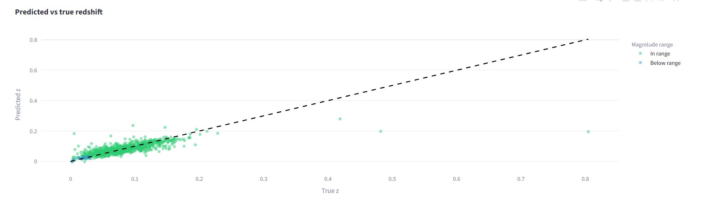

# Photometric Redshift Regression

XGBoost model + Streamlit demo that predicts galaxy redshifts from SDSS photometric
magnitudes (u, g, r, i, z), replicating the core photo-z ML pipeline used in modern
sky surveys.

**Live demo:** [your-streamlit-url]



## Why

Spectroscopic redshifts are accurate but slow and expensive. Photometric redshifts
estimate the same quantity from broad-band imaging — orders of magnitude cheaper
and applicable to every galaxy in a survey. Photo-z accuracy directly limits the
cosmological constraints a survey can place.

## Results

| Model            | MAE    | RMSE   | R²    |
|------------------|--------|--------|-------|
| LinearRegression | [fill] | [fill] | [fill]|
| RandomForest     | [fill] | [fill] | [fill]|
| **XGBoost**      | [fill] | [fill] | [fill]|

## Stack

Python · scikit-learn · XGBoost · pandas · Plotly · Streamlit.

## Run locally

```bash
pip install -r requirements.txt
# put SDSS CSV at data/sdss_sample.csv
python train.py
streamlit run streamlit_app.py
```

## Data

SDSS DR18 galaxy sample. Filtered to `class == 'GALAXY'` and
`0 < redshift < 1.0`. Full CSV not committed (size); a 1000-row sample lives at
`data/sample_small.csv` for the demo.

## Author

Juan Carlos Ruelas — [LinkedIn](https://www.linkedin.com/in/juan-ruelas/)

## License

MIT
